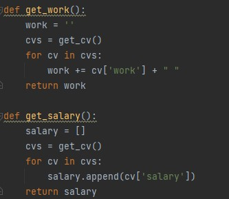
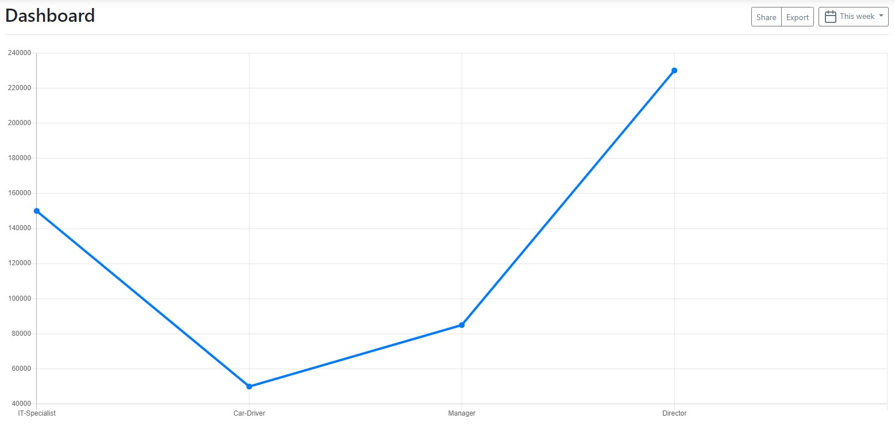
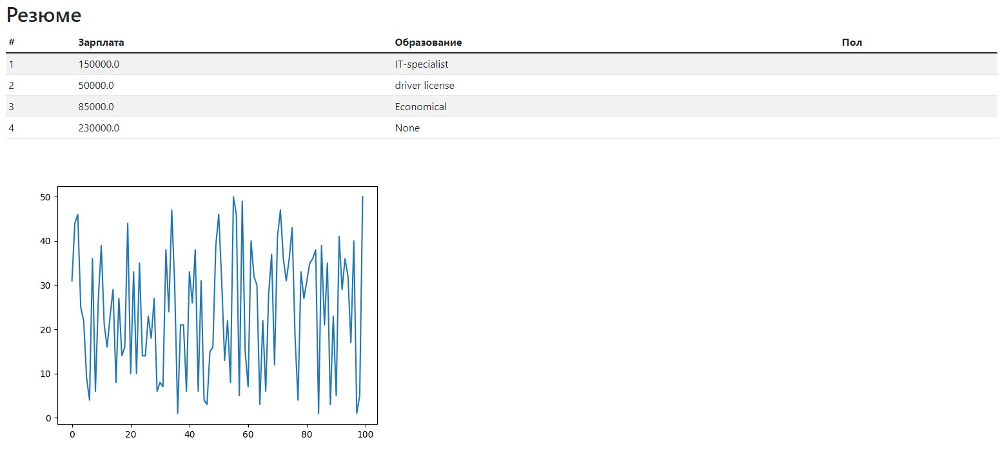
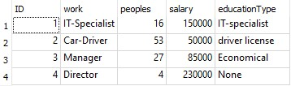

В файлах main я сделал шаги задания с первого по седьмой
В домашнем задании я преобразовал график. Теперь он отображает работу и зарплату, на основе созданной мной базе данных.
В коде скрипта я добавил: 
<code>
let works = '{{ work }}';
</code> 
<code>
const splitedLabels = works.split(" ");
</code> 
<code>
let qs = 'dsdsd';
</code> 
<code>
let salaries = {{ salary }}; 
</code> 
И тогда в описании таблицы добавляем
<code>labels: splitedLabels,</code>
и
<code>data: salaries,</code>.
Изменил функцию <b>dashboard</b>, добавив в нее соответствующие перменные: 
<code>
@app.route("/dashboard")
</code> 
<code>
def dashboard():
</code> 
<code>
return render_template('d3-dz.html',
</code> 
<code>
cvs=get_cv(), work=get_work(), salary=get_salary(),
</code> 
<code>
)
</code> 
и добавил функции: 
 
<b>Результат:<b> 
 
  
<b>Созданная база данных:<b> 
 
